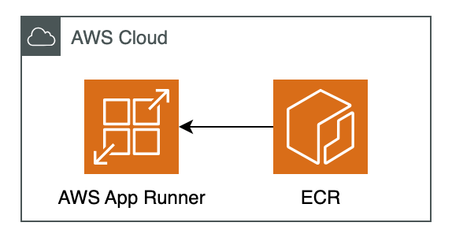

# AWS App Runner Nginx デプロイ


<p align="center">
  
</p>


## 概要
このリポジトリでは、Terraformを使用してAWS App RunnerにNginxをデプロイする方法を提供しています。このソリューションを使用すると、コンテナ化されたNginxウェブサーバーをAWSのサーバーレスコンピューティングプラットフォームであるApp Runnerに簡単にデプロイできます。

## 主な機能
+ 静的コンテンツの配信

## システム構成
システムは以下の主要コンポーネントで構成されています：

+ AWS ECR (Elastic Container Registry) - カスタムNginxイメージを格納
+ Dockerイメージ - 基本的なNginx設定を含むカスタムコンテナ
+ AWS App Runner - Nginxを実行するサーバーレスコンピューティング環境
+ IAMロールとポリシー - App RunnerがECRからイメージをプルするために必要な権限

## 起動とデプロイ方法

以下のコードを実行してインフラを構築します。
```
bin/terraform_apply
```

### 停止
以下のコードを実行すると停止できます。
```
bin/terraform_destroy
```
